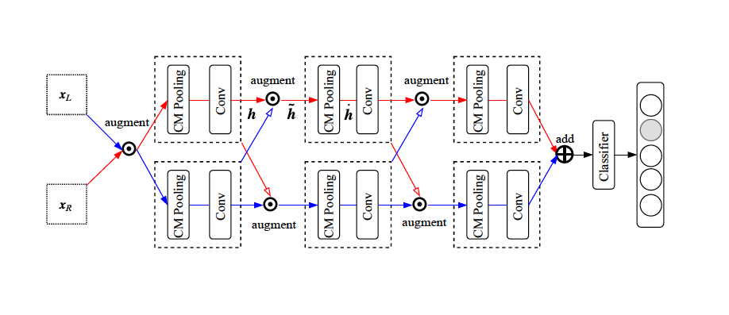

# CNN^2
This is the repo for "CNN^2: Viewpoint Generalization via a Binocular Vision", Wei-Da Chen, Shan-Hung Wu, In Proceedings of NeurIPS 2019.

We propose CNN^2, a CNN that takes two images as input, which resembles the process of an object being viewed from the left eye and the right eye. The mechanisms proposed in the model include:
 * dual feedforward pathways
 * dual parallax augmentation
 * concentric multi-scale pooling

<!-- In the paper, we proposed **Ego-Convolution** layer, which keeps the nice properties of Convolution layer to the graph including:
 * detection of location-invariant patterns
 * enlarged receptive fields in multi-layer architecture
 * [most importantly] detection of **precise** patterns -->

CNN^2 uses novel augmentation, pooling, and convolutional layers to learn a sense of three-dimensionality in a recursive manner. 
<!-- This enables our Ego-CNN to provide explanation to its prediction when jointly learned with a task. -->

 1. CNN^2 employs two parallel, yet complementary, feedforward pathways for the left and right eye images, respectively. 
 2. At each layer, the binocular images or feature maps are combined and then split by following the dual parallax augmentation procedure.
 3. Concentric multi-scale (CM) pooling aids the filter in the next layer to easily detect stereoscopic patterns, by contrasting blurry features with clear features.

## Dependence
 * Python >= 3.6
 * Tensorflow >= 2.0.0-alpha0
 * Numpy >= 1.13, Matplotlib >= 2.1

## To Reproduce Our Results On NeurIPS'19

### Step 1. Download and Preprocess Datasets
Download all the binocular datasets used in the paper. [Link]("https://drive.google.com/open?id=1S47qOBWZtSA4emTQNCR3mft6lUyJB4ke")

### Step 2. Evaluate CNN^2 performance on task of viewpoint generalization.
 * Used the model in `cnn2.py` in the task of viewpoint generalization.
 * Run `cnn2_modelnet.ipynb`, `cnn2_smallnorb.ipynb`, and `cnn2_rgbd.ipynb` to evaluate the performance in the paper.
<!-- To reproduce ..
 * Viewpoint Generalization: 
 * Graph Classification Experiments: run `./execute-graph-classification-on-benchmarks.sh`
 * Effectiveness of Scale-Free Regularizer: run `./execute-graph-classification-on-benchmarks.sh`
 * Visualization on synthetic compounds: run `./execute-graph-classification-on-benchmarks.sh` -->